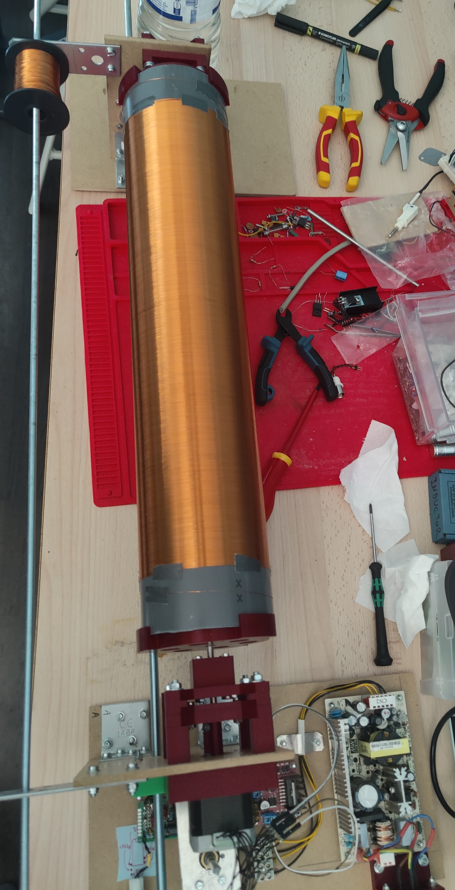

# Tesla coil winding machine

### Overview
The machine uses 2 cones to hold the coil in place. Their shape allows the user to wind different coil sizes, from 40 mm to 200 mm in diameter.  

### Electronics
The machine uses a stepper motor to rotate the coil for its low speed and high torque.  
In this case, the circuit is powered by a 24V supply and consumes less than 150 mA with motor under load.  
An [L298N](https://www.st.com/resource/en/datasheet/l298.pdf) based module drives the motor and is controlled by an [ATtiny44A](https://ww1.microchip.com/downloads/en/DeviceDoc/ATtiny24A-44A-84A-DataSheet-DS40002269A.pdf) microcontroller.  
A footswitch enables the motor driver. Speed is controlled by a potentiometer and motor direction by another switch. See [schematic](https://github.com/antonin-leclercq/tesla-coil-winding-machine/blob/master/board/electronics-schematic.pdf) for details.

### First coil

This is the first coil made using this machine. It's about 60 cm tall and is made of 28 AWG wire wound around a 10 cm diameter PVC pipe.
